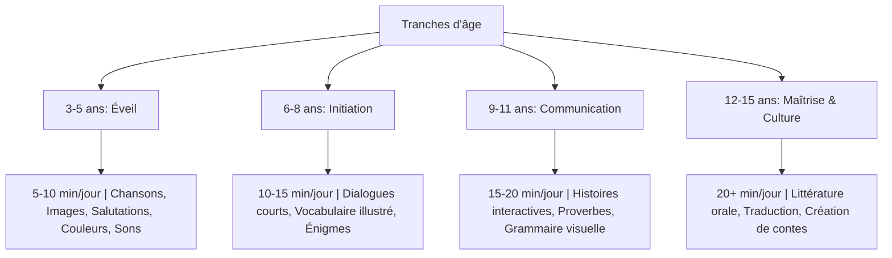
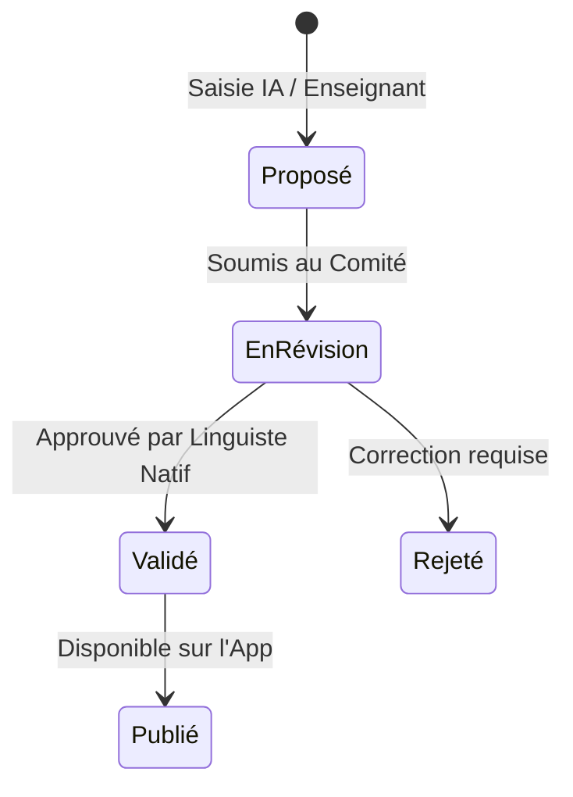

# 🇨🇬 CAHIER DES CHARGES FONCTIONNEL ET TECHNIQUE
## MWANA LARI — VERSION 1.0 (MVP & ECOSYSTÈME FONDATEUR)

> **Devise** : *« Apprendre sa langue. Comprendre ses racines. Préparer son avenir. »*  
> **Auteur** : Équipe Mwana Lari & Ingénierie EdTech  
> **Statut** : Document de référence V1.0 (Validé)  
> **Cible** : Développeurs, Designers UX/UI, Experts Linguistes & Moteurs d'IA / Vibe Coding  

---

## TABLE DES MATIÈRES
1. [Vision, Mission & Positionnement Stratégique](#1-vision-mission--positionnement-stratégique)
2. [Matrice des Personas & Droits d'Accès](#2-matrice-des-personas--droits-daccès)
3. [Programme Pédagogique (Tranches d'âge 3–15 ans)](#3-programme-pédagogique-tranches-dâge-315-ans)
4. [Spécifications Fonctionnelles Détaillées (MVP)](#4-spécifications-fonctionnelles-détaillées-mvp)
   - 4.1. Académie du Lari
   - 4.2. Laboratoire Audio & Prononciation
   - 4.3. Nzolo ya Bakulu (La Voix de nos Aînés)
   - 4.4. Dictionnaire Intelligent & Culturel
   - 4.5. Moteur de Gamification & Arbre Linguistique
   - 4.6. Espace Famille & Défis Familiaux
   - 4.7. Mwana Lari École (Dashboard Enseignant)
5. [Architecture Technique & SaaS Multi-langues](#5-architecture-technique--saas-multi-langues)
   - 5.1. Stack Technologique (Next.js / FastAPI / PostgreSQL / Redis / S3)
   - 5.2. Schéma Architectural & Flux de Données
   - 5.3. Pipeline de Gouvernance Linguistique (`linguistic_validations`)
   - 5.4. Stratégie Offline & PWA Sync
6. [Modèle de Données Relationnel (PostgreSQL Multi-tenant / Multi-langues)](#6-modèle-de-données-relationnel-postgresql)
7. [Spécification des APIs & Endpoints REST](#7-spécification-des-apis--endpoints-rest)
8. [Wireframes & User Experience (Les 9 Écrans Majeurs MVP)](#8-wireframes--user-experience-les-9-écrans-majeurs-mvp)
9. [Feuille de Route de Développement & Modèle Économique](#9-feuille-de-route-de-développement--modèle-économique)
10. [Indicateurs de Performance (KPIs) & Vision à 5 Ans](#10-indicateurs-de-performance-kpis--vision-à-5-ans)

---

## 1. VISION, MISSION & POSITIONNEMENT STRATÉGIQUE

### 1.1. Diagnostic du Problème
En Afrique subsaharienne et dans les diasporas, le passage au tout-numérique et l'enseignement scolaire exclusif en langues internationales (Français, Anglais) génèrent une rupture intergénérationnelle majeure :
* **Enfants (3-15 ans)** : Évoluent dans un univers numérique (écrans, réseaux sociaux, école) exclusivement francophone ou anglophone.
* **Parents & Grands-parents** : Détiennent la mémoire familiale, la littérature orale (contes, proverbes, sagesses) et la langue Lari, mais manquent d'outils attrayants pour les transmettre dans l'écosystème quotidien des enfants.

### 1.2. Vision & Mission
* **Vision** : Faire de Mwana Lari la référence EdTech et patrimoniale d'Afrique Centrale pour l'apprentissage, la sauvegarde et la valorisation du Lari, tout en construisant le moteur SaaS réutilisable pour toutes les langues africaines (*Mwana Languages Platform*).
* **Mission** : Transmettre la langue, la mémoire et la culture Lari aux enfants sans compromettre leur maîtrise du Français et de l'Anglais.

### 1.3. Les 4 Piliers Fondateurs
```
┌────────────────────────────────────────────────────────────────────────┐
│                              MWANA LARI                                │
├──────────────┬──────────────────┬────────────────────┬─────────────────┤
│   🗣️ LANGUE   │    📚 CULTURE    │     👨‍👩‍👧 FAMILLE    │  🤖 TECHNOLOGIE │
│ Apprentissage│ Contes, proverbes│ Reconnexion des    │ Audio HD, PWA,  │
│ progressif   │ & littérature    │ générations        │ IA supervisée & │
│ interactif   │ orale Lari       │ via défis communs  │ Gamification    │
└──────────────┴──────────────────┴────────────────────┴─────────────────┘
```

---

## 2. MATRICE DES PERSONAS & DROITS D'ACCÈS

Le système est conçu de manière multi-profils native avec une séparation stricte des fonctionnalités et des accès.

| Rôle | Profil Cible | Objectifs & Usages | Droits Système & Sécurité |
| :--- | :--- | :--- | :--- |
| **👶 Enfant (Child)** | 3–5, 6–8, 9–11, 12–15 ans | Apprendre en jouant, suivre l'histoire de Koko, enregistrer sa voix, débloquer des badges. | Accès restreint (Pas de paiement, interface simplifiée, PIN parent requis pour sortir). |
| **👨‍👩‍👧 Parent** | Parents d'enfants de 3-15 ans | Gérer les profils enfants, suivre le temps d'écran et la progression, lancer des défis familiaux, souscrire à l'abonnement. | Supervision complète des sous-comptes enfants, accès billing & statistiques. |
| **👵 Grand-parent / Aîné** | Locuteurs natifs, aînés | Transmettre des enregistrements audio (contes, proverbes, recettes, voix de famille). | Espace de contribution audio ("Nzolo ya Bakulu"), enregistrement guidé simplifié. |
| **👨‍🏫 Enseignant (Teacher)** | Enseignants & Écoles | Créer des classes, assigner des devoirs, suivre le taux de réussite par mot/leçon. | Dashboard analytique de classe, génération de rapports PDF/Excel. |
| **🛡️ Expert Linguiste / Admin** | Comité Scientifique Lari | Valider les traductions, les audios et les règles grammaticales créées ou saisies. | Modération stricte, accès à la table `linguistic_validations`, publication de contenu. |

---

## 3. PROGRAMME PÉDAGOGIQUE (TRANCHES D'ÂGE 3–15 ANS)

La pédagogie adapte la durée d'attention, le format visuel et les mécanismes de rétention selon la tranche d'âge.



### 3.1. Niveaux Académiques Unifiés (Niveau 1 à 5)
1. **Niveau 1 — Découverte** : Salutations (*Mbote*), Famille (*Nzo*, *Mama*, *Tata*), Corps humain, Animaux, Couleurs, Chiffres (1-10), Nourriture.
2. **Niveau 2 — Communication** : Se présenter, exprimer des émotions, poser des questions simples (*Nki?*, *Nani?*), ordres et formules de politesse.
3. **Niveau 3 — Conversation** : La maison, l'école, le marché, les jeux, le temps qu'il fait, structuration des phrases Sujet-Verbe-Complément.
4. **Niveau 4 — Lecture & Écriture** : Alphabet Lari, phonèmes spécifiques, lecture de mots complexes, petits textes narratifs.
5. **Niveau 5 — Patrimoine & Culture** : Proverbes (*Bisiya*), contes traditionnels (*Binkulu*), chants d'initiation, histoire et sagesses locales.

---

## 4. SPÉCIFICATIONS FONCTIONNELLES DÉTAILLÉES (MVP)

### 4.1. 📖 Académie du Lari
* **Personnage Guide (Koko le Renard/Galago)** : Avatar virtuel interactif qui réagit aux réussites et erreurs de l'enfant avec des expressions vocales Lari (*Bambote!*, *Inga!*, *Nsiya!*).
* **Format des Leçons** : Cartes mémoire interactives (Flashcards), association texte/image/son, quiz à choix multiples (QCM), phrases à trous.

### 4.2. 🎧 Laboratoire Audio & Prononciation
* **Fonctionnement** :
  1. 🔊 **Écouter** : Déclenchement de l'audio HD enregistré par un locuteur natif validé.
  2. 🎙️ **Répéter** : L'enfant appuie sur le micro et enregistre sa prononciation (stockage temporaire IndexedDB/S3).
  3. ✓ **Comparer & Valider** : Algorithme de comparaison d'onde sonore de base (MVP) puis évaluation IA automatique (Phase 5).

### 4.3. 👵 Nzolo ya Bakulu (« La Voix de nos Aînés »)
Bibliothèque numérique de transmission orale intergénérationnelle.
```
┌─────────────────────────────────────────────────────────────────────────┐
│                      PIPELINE NZOLO YA BAKULU                           │
├───────────────┐     ┌──────────────┐     ┌────────────────┐     ┌───────┴───────┐
│ Enregistrement│     │ Upload Audio │     │ Transcription  │     │ Validation    │
│ par l'Aîné    │ ──> │ S3 Storage   │ ──> │ & Traduction   │ ──> │ Comité Linguis│
└───────────────┘     └──────────────┘     └────────────────┘     └───────┬───────┘
                                                                          │
                                                                  ┌───────▼───────┐
                                                                  │ Publication   │
                                                                  │ App Enfant    │
                                                                  └───────────────┘
```

### 4.4. 🧠 Dictionnaire Intelligent & Culturel
Une recherche (ex: *"Maison"*) renvoie un résultat multimodale enrichi :
* Mot Lari : **Nzo** (Pluriel : *Binzo*)
* Prononciation Audio 🔊 : `/n-zo/`
* Traduction : 🇫🇷 Maison, Édifice | 🇬🇧 House
* Explication Culturelle : Origine du mot et symbole de la famille élargie dans la tradition Lari.
* Expressions liées : *Nzo ya nkulu* (Maison ancestrale).

### 4.5. 🎮 Moteur de Gamification & Arbre Linguistique
* **Points d'Expérience (XP)** : Earn 10 XP par leçon complétée, 5 XP par écoute de conte.
* **Badges** : *Premier Mot*, *Maître des Salutations*, *Gardien des Proverbes*, *Ambassadeur Lari*.
* **Série (Streak)** : Compteur de jours d'apprentissage consécutifs avec bonus d'XP.
* **Arbre Linguistique Visuel** : Un baobab interactif qui pousse et verdit au fur et à mesure que l'enfant progresse dans les leçons.

### 4.6. 👨‍👩‍👧 Espace Famille & Défis Familiaux
* **Défi du Dimanche** : Notification hebdomadaire incitant parents et enfants à prononcer 5 phrases spécifiques en Lari durant le repas.
* **Enregistrement Souvenir** : L'enfant enregistre sa grand-mère racontant un souvenir directement depuis le smartphone familial.

### 4.7. 🏫 Mwana Lari École (Dashboard Enseignant)
* **Gestion de Classe** : Import d'élèves, génération de codes d'accès uniques.
* **Statistiques** : Taux de complétion des devoirs, mots les plus difficiles pour la classe, courbe de progression individuelle.

---

## 5. ARCHITECTURE TECHNIQUE & SAAS MULTI-LANGUES

### 5.1. Stack Technologique
* **Frontend** : Next.js 14 (App Router), TypeScript, Tailwind CSS, Lucide Icons, Framer Motion (animations), Progressive Web App (PWA) avec Workbox.
* **Backend API** : FastAPI (Python 3.11), Pydantic v2, SQLAlchemy 2.0 / AsyncPG, Celery (tâches asynchrones audio).
* **Base de Données & Cache** : PostgreSQL 16 (avec schéma partitionné multi-langues), Redis 7 (gestion de session, cache et leaderboard XP).
* **Stockage Médias** : S3 Compatible Storage (MinIO en dev, Cloudflare R2 / AWS S3 en prod) pour les fichiers audio .mp3/.ogg et images SVG/WebP.
* **Paiement & Abonnements** : Intégration Stripe (cartes bancaires) + PayDunya / Bizao / CinetPay (Mobile Money MTN & Airtel pour l'Afrique Centrale).

### 5.2. Architecture Système
```text
                          CLIENTS (Web, Mobile PWA)
                                     │
                        ┌────────────┴────────────┐
                        ▼                         ▼
                  Next.js Frontend         PWA Offline Storage
                  (React / Tailwind)       (IndexedDB Cache)
                        │
                        ▼
                 API Gateway / HTTPS
                        │
                        ▼
                 FastAPI Backend
                        │
       ┌────────────────┼────────────────┬────────────────┐
       ▼                ▼                ▼                ▼
PostgreSQL DB       Redis Cache      S3 Media Storage   Worker Audio
(Données & Graph)   (Leaderboard)    (Audios/Images)    (Celery / FFmpeg)
```

### 5.3. Pipeline de Gouvernance Linguistique (`linguistic_validations`)
Pour éviter toute hallucination de l'IA ou erreur de traduction, **aucun mot ne peut apparaître dans l'application enfant sans validation humaine**.


### 5.4. Stratégie Offline (PWA)
En raison de la variabilité de la connexion internet dans certaines régions du Congo et d'Afrique :
* Téléchargement automatique des leçons du niveau en cours (Audio + Textes) dans `IndexedDB`.
* Synchronisation transparente des points XP et séries dès la reconnexion à l'API.

---

## 6. MODÈLE DE DONNÉES RELATIONNEL (POSTGRESQL)

Le schéma est nativement conçu pour être **multilingue** (`language_id`), autorisant le déploiement immédiat de *Mwana Lingala*, *Mwana Kikongo*, etc., sans altération de la structure SQL.

```sql
-- 1. Table des Langues supportées par la plateforme
CREATE TABLE languages (
    id VARCHAR(10) PRIMARY KEY, -- Ex: 'LAR' (Lari), 'LIN' (Lingala), 'KIK' (Kikongo)
    name VARCHAR(100) NOT NULL,
    iso_code VARCHAR(10),
    is_active BOOLEAN DEFAULT TRUE,
    created_at TIMESTAMP WITH TIME ZONE DEFAULT CURRENT_TIMESTAMP
);

-- 2. Table des Utilisateurs (Parents, Enseignants, Admin)
CREATE TABLE users (
    id UUID PRIMARY KEY DEFAULT gen_random_uuid(),
    email VARCHAR(255) UNIQUE,
    phone_number VARCHAR(50) UNIQUE,
    password_hash VARCHAR(255) NOT NULL,
    role VARCHAR(50) NOT NULL CHECK (role IN ('PARENT', 'TEACHER', 'LINGUIST', 'ADMIN')),
    full_name VARCHAR(150),
    country_code VARCHAR(5) DEFAULT 'CG',
    created_at TIMESTAMP WITH TIME ZONE DEFAULT CURRENT_TIMESTAMP
);

-- 3. Table des Profils Enfants (liés à un Parent)
CREATE TABLE children (
    id UUID PRIMARY KEY DEFAULT gen_random_uuid(),
    parent_id UUID NOT NULL REFERENCES users(id) ON DELETE CASCADE,
    first_name VARCHAR(100) NOT NULL,
    age_group VARCHAR(20) NOT NULL CHECK (age_group IN ('3-5', '6-8', '9-11', '12-15')),
    avatar_id VARCHAR(100) DEFAULT 'koko_default',
    xp_points INT DEFAULT 0,
    current_streak INT DEFAULT 0,
    created_at TIMESTAMP WITH TIME ZONE DEFAULT CURRENT_TIMESTAMP
);

-- 4. Table du Dictionnaire (Mots)
CREATE TABLE words (
    id UUID PRIMARY KEY DEFAULT gen_random_uuid(),
    language_id VARCHAR(10) NOT NULL REFERENCES languages(id),
    word_native VARCHAR(200) NOT NULL, -- Ex: "Nzo"
    phonetic VARCHAR(200),             -- Ex: "[n-zo]"
    translation_fr VARCHAR(255) NOT NULL, -- Ex: "Maison"
    translation_en VARCHAR(255),          -- Ex: "House"
    category VARCHAR(100) NOT NULL,       -- Ex: "Famille", "Maison"
    difficulty_level INT DEFAULT 1,
    cultural_note TEXT,                   -- Explication culturelle
    created_at TIMESTAMP WITH TIME ZONE DEFAULT CURRENT_TIMESTAMP
);

-- 5. Table des Audio de Prononciation
CREATE TABLE pronunciations (
    id UUID PRIMARY KEY DEFAULT gen_random_uuid(),
    word_id UUID NOT NULL REFERENCES words(id) ON DELETE CASCADE,
    audio_url VARCHAR(500) NOT NULL,
    speaker_type VARCHAR(50) CHECK (speaker_type IN ('NATIVE_ELDER', 'TEACHER', 'STUDIO')),
    is_primary BOOLEAN DEFAULT TRUE,
    created_at TIMESTAMP WITH TIME ZONE DEFAULT CURRENT_TIMESTAMP
);

-- 6. Table des Validations Linguistiques (Sécurité & Qualité)
CREATE TABLE linguistic_validations (
    id UUID PRIMARY KEY DEFAULT gen_random_uuid(),
    entity_type VARCHAR(50) NOT NULL, -- 'WORD', 'STORY', 'PROVERB'
    entity_id UUID NOT NULL,
    validator_id UUID NOT NULL REFERENCES users(id),
    status VARCHAR(50) NOT NULL CHECK (status IN ('PENDING', 'APPROVED', 'REJECTED')),
    comments TEXT,
    validated_at TIMESTAMP WITH TIME ZONE DEFAULT CURRENT_TIMESTAMP
);

-- 7. Table des Contes et Proverbes (Patrimoine Nzolo ya Bakulu)
CREATE TABLE cultural_items (
    id UUID PRIMARY KEY DEFAULT gen_random_uuid(),
    language_id VARCHAR(10) NOT NULL REFERENCES languages(id),
    type VARCHAR(50) NOT NULL CHECK (type IN ('STORY', 'PROVERB', 'SONG')),
    title_native VARCHAR(255) NOT NULL,
    title_fr VARCHAR(255) NOT NULL,
    content_native TEXT NOT NULL,
    content_fr TEXT NOT NULL,
    audio_url VARCHAR(500),
    elder_speaker_name VARCHAR(150),
    moral_lesson TEXT,
    created_at TIMESTAMP WITH TIME ZONE DEFAULT CURRENT_TIMESTAMP
);

-- 8. Table de Progression des Enfants
CREATE TABLE child_progress (
    id UUID PRIMARY KEY DEFAULT gen_random_uuid(),
    child_id UUID NOT NULL REFERENCES children(id) ON DELETE CASCADE,
    lesson_id VARCHAR(100) NOT NULL,
    score INT DEFAULT 0,
    completed_at TIMESTAMP WITH TIME ZONE DEFAULT CURRENT_TIMESTAMP,
    UNIQUE(child_id, lesson_id)
);
```

---

## 7. SPÉCIFICATION DES APIS & ENDPOINTS REST

### 7.1. Authentification & Gestion des Profils
* `POST /api/v1/auth/register` : Création du compte Parent / Enseignant.
* `POST /api/v1/auth/login` : Connexion et émission de JWT Tokens.
* `POST /api/v1/parents/children` : Ajout d'un profil enfant (Nom, Tranche d'âge, Avatar).
* `GET /api/v1/parents/children/{child_id}/progress` : Statistiques de progression de l'enfant.

### 7.2. Module Apprentissage & Dictionnaire
* `GET /api/v1/lessons?language=LAR&age_group=6-8` : Récupération du parcours adapté.
* `GET /api/v1/words/search?q=maison&lang=LAR` : Dictionnaire intelligent multimodal.
* `POST /api/v1/progress/submit` : Envoi du résultat d'une leçon (mise à jour XP & séries dans Redis/Postgres).

### 7.3. Module Nzolo ya Bakulu (Patrimoine Audio)
* `GET /api/v1/heritage/stories` : Liste des contes audio disponibles.
* `POST /api/v1/heritage/contribute` : Upload d'un fichier audio par une famille/grand-parent (mis en statut `PENDING`).

---

## 8. WIREFRAMES & USER EXPERIENCE (LES 9 ÉCRANS MAJEURS MVP)

```text
┌────────────────────────────────────────────────────────────────────────┐
│                        ARBORESCENCE DES 9 ÉCRANS                       │
├──────────────────┬──────────────────┬──────────────────────────────────┤
│ 1. Accueil / Auth│ 2. Sélection Âge │ 3. Dashboard "Mbote, Mwana!"     │
├──────────────────┼──────────────────┼──────────────────────────────────┤
│ 4. Module Apprendre│ 5. Labo Audio   │ 6. Jeu / Énigmes de Koko         │
├──────────────────┼──────────────────┼──────────────────────────────────┤
│ 7. Nzolo ya Bakulu│ 8. Dictionnaire │ 9. Espace Famille / Profil       │
└──────────────────┴──────────────────┴──────────────────────────────────┘
```

### Écran 3 — Dashboard Enfant (« Mbote, Mwana! 👋 »)
* Header : Avatar Koko animé, Jauge XP (*120 XP*), Série (*🔥 5 jours*), Baobab de progression.
* Carrousel principal : "Continuer la leçon : La Famille (Leçon 3)".
* Grille d'accès rapide : 📖 Académie | 🎧 Labo Audio | 👵 Contes des Anciens | 🎮 Défis.

### Écran 5 — Laboratoire Audio
* Carte centrale : Mot illustré (ex: **MAMA** avec image).
* Bouton 🔊 Grand Format : Écoute de la prononciation du locuteur natif.
* Bouton 🎙️ Rouge Central : Enregistrement de l'enfant avec animation d'onde audio.
* Feedback visuel immédiat : ⭐⭐⭐ + Bouton "Répéter" ou "Continuer".

---

## 9. FEUILLE DE ROUTE DE DÉVELOPPEMENT & MODÈLE ÉCONOMIQUE

### 9.1. Roadmap par Phases
```
Phase 0 : Recherche & Collecte du Corpus Lari (1000 mots, 100 proverbes, audios) ── [Mois 1-2]
Phase 1 : Développement du Core Engine & Schéma DB PostgreSQL ─────────────── [Mois 2-3]
Phase 2 : Développement du Frontend Next.js MVP (9 Écrans) ──────────────────── [Mois 3-4]
Phase 3 : Test Pilote avec 50 Familles à Brazzaville / Pointe-Noire ─────────── [Mois 5]
Phase 4 : Lancement V1.0 Commerciale & Partenariats Écoles ──────────────────── [Mois 6]
```

### 9.2. Modèle Économique (Freemium & SaaS Multi-canaux)
1. **Offre Gratuit (Freemium)** : Accès au Niveau 1 (Découverte), 20 mots du dictionnaire, 2 contes audio.
2. **Abonnement Premium Famille** : 2 000 à 3 000 FCFA / mois (ou ~4.99 €/mois diaspora). Accès illimité aux 5 niveaux, espace famille, mode hors-ligne PWA, et téléchargements des contes.
3. **Licence Mwana Lari École** : Forfait annuel par établissement scolaire (~500 FCFA / élève / an) donnant accès au Dashboard Enseignant.
4. **Mwana Languages SaaS (Licence Technologique)** : Vente du moteur de la plateforme à d'autres organisations pour déployer *Mwana Kikongo*, *Mwana Lingala*, *Mwana Tshiluba*, etc.

---

## 10. INDICATEURS DE PERFORMANCE (KPIS) & VISION À 5 ANS

### 10.1. KPIs d'Impact Linguistique & Culturel
* **Rétention & Répétition** : % d'enfants conservant une série de 7 jours consécutifs.
* **Volume Patrimonial** : Nombre d'heures d'audio d'aînés collectées et validées dans *Nzolo ya Bakulu*.
* **Maîtrise Linguistique** : Nombre moyen de mots Lari correctement restitués à l'oral après 90 jours d'utilisation.

### 10.2. Vision à 5 Ans : L'Écosystème Mwana
```text
                             MWANA LANGUAGES PLATFORM
                                        │
           ┌────────────────────────────┼────────────────────────────┐
           ▼                            ▼                            ▼
      MWANA LARI                 MWANA LINGALA                 MWANA KIKONGO
 (Pilote Congo-Brazza)       (Congo RDC / Brazza)            (Congo / Angola)
           │                            │                            │
           └────────────────────────────┼────────────────────────────┘
                                        ▼
                                 MWANA HERITAGE
                (Bibliothèque Numérique des Langues Africaines)
```

---
*Ce cahier des charges constitue le document de référence officiel V1.0 du projet Mwana Lari. Toute mise à jour de la structure ou du modèle de données doit faire l'objet d'un amendement validé par le comité technique et linguistique.*
